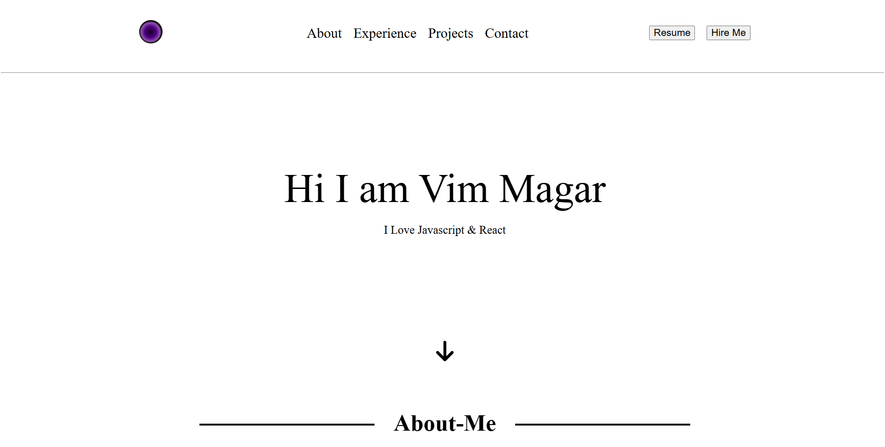

# Vim Magar – Personal Portfolio Website 🌐

Welcome to the source code for my personal portfolio website. This website is a showcase of my web development skills, experience, and featured projects. It is built using **HTML, CSS, JavaScript**, along with some **Tailwind** and **Bootstrap** for responsive design.

---

## 🖼️ Preview

<!-- Add a screenshot or GIF of the website here -->
)

---

## 📁 Project Structure

```
├── index.html             # Main HTML file
├── simple.css             # Custom stylesheet
├── /images                # All project and personal images
│   ├── Brand.jpg
│   ├── miyamura.jpg
│   ├── ex.png
│   ├── finder.png
│   ├── qr.png
│   ├── todoList.png
│   ├── feedbackUi.png
│   ├── rating.png
```

---

## 🔥 Features

- Clean, responsive design
- Hero section with introduction
- About Me and Experience sections
- Featured Projects with links to GitHub and Live Demos
- Other Mini Projects (React and JavaScript-based)
- Social Links and Contact Section
- Font Awesome icons for styling

---

## 🛠️ Technologies Used

- HTML5
- CSS3
- JavaScript (Vanilla)
- GitHub Pages / Vercel (for deployment)

---

## 🚀 Live Demo

> Visit: [https://your-portfolio-live-link.com](https://vim-index-portfolio.vercel.app/)

---

## 🧠 How to Use

1. Clone the repository:
   ```bash
   git clone https://github.com/Bheem-Works/VimIndexPortfolio.git
   cd portfolio-website
   ```

2. Open `index.html` in your browser:
   ```bash
   open index.html
   ```

3. Customize the content, images, and links to make it your own.

---

## 📬 Contact

Feel free to connect with me:

- LinkedIn: [Vim Magar](https://www.linkedin.com/in/vim-magar-143a50310/)
- GitHub: [bheem-works](https://github.com/bheem-works)

---

## 📄 License

This project is open source and free to use. Customize it to make it your own portfolio!

